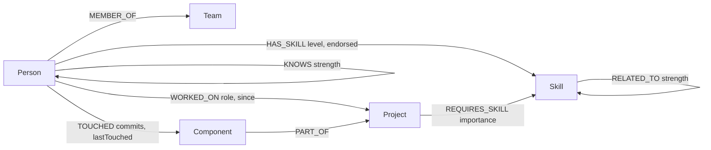

# TeamGraph

**An expert-finder and code-owner router for engineering orgs, backed by [CognoDB](https://console.cognodb.com).**

> "Who can help me with X?" "Who should review this PR?" "Is this project one departure away from losing its only expert?" — questions about *connections*, answered by walking a graph instead of joining tables.

Live demo: _add your hosted URL here_
Screen recording: _add your recording link here_

---

## Table of contents

- [The use case](#the-use-case)
- [Why a graph database?](#why-a-graph-database)
- [Data model](#data-model)
- [The queries](#the-queries)
- [Setup](#setup)
- [Running locally](#running-locally)
- [Project structure](#project-structure)
- [Screenshots](#screenshots)

---

## The use case

TeamGraph models an engineering organization as a graph — people, teams, skills, projects, and the
code components they touch — and answers questions a manager or tech lead actually asks day to day:

- **Find an expert** — not just "who lists React on their profile," but "who's genuinely close to
  this skill," including people whose *adjacent* skills make them a good fit, and people close to
  *you* in the collaboration network.
- **Who should review this PR?** — ranked by who's actually touched this project's code recently.
- **Is this project fully staffed?** — which required skills nobody on the team currently holds,
  and which are covered by exactly one person (a bus-factor risk).
- **How do two people connect?** — the shortest chain of collaborators between anyone and anyone
  else, for onboarding ("who introduces me to the payments team?") or org-design conversations.

## Why a graph database?

The relationships are the point here, not the records. A few concrete comparisons:

| Question | In TeamGraph (Cypher) | In a relational schema |
|---|---|---|
| Who's within 2 hops of me in the collaboration network and knows GraphQL? | One variable-length pattern: `(me)-[:KNOWS*1..2]-(candidate)-[:HAS_SKILL]->(:Skill {name:'GraphQL'})` | A self-join per hop, or a recursive CTE, re-run for every depth you care about |
| Who has a skill *related* to the one I need, weighted by how related? | `(target)-[r:RELATED_TO*1..2]-(related)<-[:HAS_SKILL]-(p)` with `reduce()` multiplying relationship weights along the path | A recursive CTE to walk the adjacency table, plus a running-product aggregate carried through the recursion by hand |
| Shortest chain connecting two arbitrary people? | `shortestPath((a)-[:KNOWS*..6]-(b))` — one line, no upper bound assumed in the query itself | Effectively unbounded recursive self-joins; most engines need a hard-coded max depth and still degrade badly as the graph grows |

None of this is *impossible* in SQL — recursive CTEs can express most of it. But the query stops
reading like the question you asked. In Cypher, `(me)-[:KNOWS*1..2]-(candidate)` *is* the question:
"people within two hops of me." The relational equivalent needs you to first invent a `closure`
table or write recursion by hand, and the moment a query needs a *weighted*, *ranked* path (the
skill-adjacency search) rather than just reachability, the SQL gets substantially harder to write
and to read.

The other reason a graph earns its place here: this schema is relationship-*dense*. A person
connects to a team, several skills, several projects, several components, and several other people
— and the interesting product features (expert search, reviewer suggestions, path finding) all
walk two or more of those relationship types in a single query. A relational version of this app
would work, but nearly every meaningful query would be a multi-way join across 4–6 tables with a
recursive CTE bolted on for the traversal parts. Cypher expresses the same query as a pattern that
matches the mental model of the graph.

## Data model



| Node | Key properties |
|---|---|
| `Person` | `id`, `name`, `title`, `bio`, `avatarColor` |
| `Team` | `id`, `name`, `department` |
| `Skill` | `id`, `name`, `category` (`language` \| `framework` \| `domain` \| `tool`) |
| `Project` | `id`, `name`, `description`, `status` |
| `Component` | `id`, `name`, `path` — a code module, e.g. `services/checkout/api` |

| Relationship | Properties | Notes |
|---|---|---|
| `(Person)-[:MEMBER_OF]->(Team)` | — | one team per person |
| `(Person)-[:HAS_SKILL]->(Skill)` | `level` (1–5), `endorsed` (bool) | |
| `(Skill)-[:RELATED_TO]->(Skill)` | `strength` (0–1) | stored one direction, always queried undirected — this is the skill-adjacency graph |
| `(Project)-[:REQUIRES_SKILL]->(Skill)` | `importance` (1–3) | |
| `(Person)-[:WORKED_ON]->(Project)` | `role`, `since` | |
| `(Component)-[:PART_OF]->(Project)` | — | |
| `(Person)-[:TOUCHED]->(Component)` | `commits`, `lastTouched` | code-ownership signal |
| `(Person)-[:KNOWS]->(Person)` | `strength` (0–1) | stored one direction, always queried undirected — the collaboration graph |

Seed data (see [`scripts/seed-data.ts`](scripts/seed-data.ts)): 10 teams, 47 people, 34 skills with
~32 hand-curated `RELATED_TO` edges, 12 projects with 22 components, and a `KNOWS` graph built from
team/project co-membership plus a handful of deliberate cross-team bridges — 125 nodes and 516
relationships in total, comfortably inside the free-tier sizing guidance, and dense enough for
multi-hop traversals to return interesting, non-trivial results.

## The queries

All queries live in [`src/lib/queries.ts`](src/lib/queries.ts) and run through
[`src/lib/db.ts`](src/lib/db.ts)'s `runQuery()`, the only place that touches the driver — every
statement is parameterized (`$param`, never string concatenation).

- **`getNetworkSkillMatches`** (the required 2+ hop traversal) — everyone within two `KNOWS` hops of
  a chosen person who also holds a given skill. Powers the "boost people near me" option on
  [Find an Expert](/experts).
- **`getRelatedSkillMatches`** (the "a relational database would find this awkward" query) — walks
  the `RELATED_TO` skill graph up to 2 hops out from the requested skill, multiplying relationship
  strengths along the way with `reduce()` to get a decaying path-strength score, then finds people
  holding any skill on that frontier. In SQL this needs a recursive CTE to enumerate the skill
  neighborhood *and* a running-product aggregate carried through the recursion; Cypher expresses it
  as one variable-length pattern plus a `reduce()`.
- **`findShortestPath`** — `shortestPath((a)-[:KNOWS*..6]-(b))` between two people, for the
  [Path Finder](/path). Classic graph-native operation: unbounded-depth pathfinding that's
  impractical to express efficiently in SQL without a fixed max depth.
- **`getSuggestedReviewers`** — a 2-hop `Project → Component → Person` traversal ranked by commit
  volume, for reviewer suggestions on a project page.
- **`getProjectDetail`** — required skills, staffing, and components for a project, using `CALL {}`
  subqueries per relationship type rather than multiple `OPTIONAL MATCH`es in one query, to avoid the
  classic Cypher cartesian-product trap where independent `collect()`s multiply against each other.
- **`getOverviewStats`** — includes a skill-gap count via `NOT EXISTS { }` pattern matching
  (no team member anywhere holds a skill the project requires).

Retrieval and ranking are deliberately separated: `findExperts()` in the app layer merges the three
underlying Cypher queries (direct match, related-skill match, network match) and computes a single
explainable score per person, rather than folding all three into one dense, hard-to-read Cypher
statement.

## Setup

### 1. Create a CognoDB Cloud instance

1. Sign up at [console.cognodb.com/signup](https://console.cognodb.com/signup) (no credit card
   required for the free tier).
2. Create a free **c0** instance and pick a region — provisions in under a minute.
3. Copy the connection URI (`bolt+s://<instance-id>.databases.cognodb.cloud`) and the generated
   password for user `cognodb` — **the password is shown exactly once.**

### 2. Configure the app

```bash
cp .env.example .env.local
```

Fill in `.env.local`:

```
COGNODB_URI=bolt+s://<your-instance-id>.databases.cognodb.cloud
COGNODB_USERNAME=cognodb
COGNODB_PASSWORD=<your-generated-password>
```

`.env.local` is gitignored — these values never get committed.

### 3. Install dependencies and seed the graph

```bash
npm install
npm run seed
```

`npm run seed` resets the graph (`MATCH (n) DETACH DELETE n`) and reloads the full dataset — safe to
re-run any time you want the demo back in a known state.

## Running locally

```bash
npm run dev
```

Open [http://localhost:3000](http://localhost:3000).

Other scripts: `npm run build` (production build), `npm run start` (serve the production build),
`npm run lint`.

## Project structure

```
scripts/
  seed-data.ts     — curated + generated demo dataset (teams, skills, projects, people, edges)
  seed.ts          — writes seed-data.ts into CognoDB via parameterized, batched Cypher
src/
  lib/
    db.ts          — driver singleton, the only file that touches neo4j-driver directly
    queries.ts      — every Cypher statement the app runs, parameterized, one concern per function
    types.ts        — shared domain types
  components/       — presentational building blocks (Avatar, SkillBadge, Meter, StatusBadge, …)
  app/
    layout.tsx, error.tsx        — shell + root error boundary (handles "database unreachable")
    page.tsx                     — dashboard
    experts/page.tsx             — expert search
    people/, people/[id]/        — directory + profile
    projects/, projects/[id]/    — directory + detail (skill gaps, suggested reviewers)
    path/page.tsx                — shortest-path finder
```

Every route that reads live data is `export const dynamic = "force-dynamic"` — this is graph state
that changes at runtime, not build-time content, so nothing is statically prerendered against the
database.

Database errors (misconfigured env vars, CognoDB unreachable) throw a typed error from `db.ts` and
are caught by [`error.tsx`](src/app/error.tsx), which shows a plain-language explanation and a retry
button instead of a stack trace. The top nav independently shows a live connection indicator via a
`checkHealth()` call that never throws.

## Screenshots

_Add screenshots here once the app is running against seeded data — e.g. Find an Expert results,
a project's skill-gap table, and the path finder._
